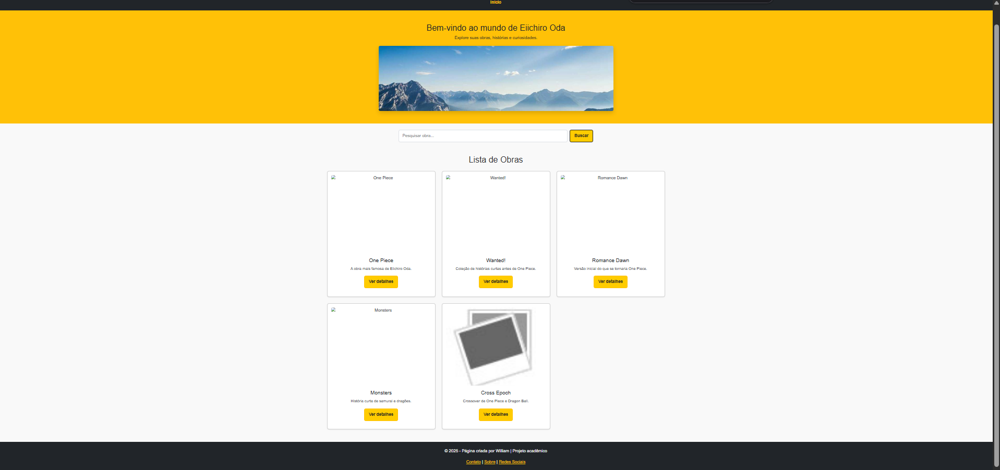
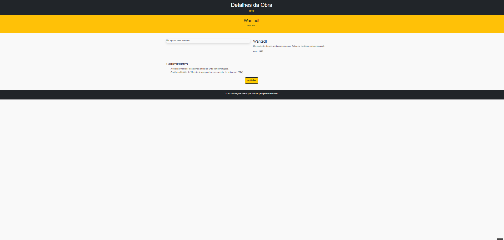

# Trabalho Prático 05 - Semanas 7 e 8

**Páginas de detalhes dinâmicas**

Nessa etapa, vamos evoluir o trabalho anterior, acrescentando a página de detalhes, conforme o  projeto escolhido. Imagine que a página principal (home-page) mostre um visão dos vários itens que existem no seu site. Ao clicar em um item, você é direcionado pra a página de detalhes. A página de detalhe vai mostrar todas as informações sobre o item do seu projeto. seja esse item uma notícia, filme, receita, lugar turístico ou evento.

Leia o enunciado completo no Canvas. 

**IMPORTANTE:** Assim como informado anteriormente, capriche na etapa pois você vai precisar dessa parte para as próximas semanas. 

**IMPORTANTE:** Você deve trabalhar e alterar apenas arquivos dentro da pasta **`public`,** mantendo os arquivos **`index.html`**, **`styles.css`** e **`app.js`** com estes nomes, conforme enunciado. Deixe todos os demais arquivos e pastas desse repositório inalterados. **PRESTE MUITA ATENÇÃO NISSO.**

## Informações Gerais

- Nome: William Augusto Lobo Freire
- Matricula: 887712
- Proposta de projeto escolhida: 1. Pessoas e Produções
- Breve descrição sobre seu projeto: O projeto consiste na criação de uma home-page dedicada ao mangaká Eiichiro Oda, criador de One Piece e contar sobre a sua obra.

## Print da Home-Page



## Print da página de detalhes do item



## Cole aqui abaixo a estrutura JSON utilizada no app.js

```javascript
const dados = [
    {
        id: 1,
        titulo: "One Piece",
        descricao: "A obra mais famosa de Eiichiro Oda.",
        conteudo: "One Piece conta a jornada de Monkey D. Luffy em busca do maior tesouro do mundo.",
        ano: 1997,
        imagem: "https://upload.wikimedia.org/wikipedia/pt/2/25/One_Piece_-_Volume_1.jpg", 
        curiosidades: [
            "É o mangá com o maior número de cópias publicadas de um único autor no mundo.",
            "O nome original de 'Gum-Gum Fruit' era 'Gomu Gomu no Mi'."
        ]
    },
    {
        id: 2,
        titulo: "Wanted!",
        descricao: "Coleção de histórias curtas antes de One Piece.",
        conteudo: "Um conjunto de one-shots que ajudaram Oda a se destacar como mangaká.",
        ano: 1992,
        imagem: "https://images-na.ssl-images-amazon.com/images/S/compressed.photo.goodreads.com/books/1388147230i/202613.jpg",
        curiosidades: [
            "A coleção Wanted! foi a estreia oficial de Oda como mangaká.",
            "Contém a história de 'Monsters' (que ganhou um especial de anime em 2024)."
        ]
    },
    {
        id: 3,
        titulo: "Romance Dawn",
        descricao: "Versão inicial do que se tornaria One Piece.",
        conteudo: "Primeira aparição de Luffy, publicada antes da serialização oficial.",
        ano: 1996,
        imagem: "https://m.media-amazon.com/images/I/41-99y6V8DL.jpg",
        curiosidades: [
            "Existem duas versões de 'Romance Dawn'.",
            "Foi um piloto que se tornou a base para o início de One Piece."
        ]
    },
    {
        id: 4,
        titulo: "Monsters",
        descricao: "História curta de samurai e dragões.",
        conteudo: "Uma das obras que mostraram a habilidade de Oda em criar mundos fantásticos.",
        ano: 1994,        imagem: "https://upload.wikimedia.org/wikipedia/pt/e/e0/Monsters_-_Capa.jpg",
        curiosidades: [
            "O protagonista, Ryuma, aparece mais tarde em One Piece.",
            "Foi uma das histórias que rendeu a Oda o prêmio Tezuka."
        ]
    },
    {
        id: 5,
        titulo: "Cross Epoch",
        descricao: "Crossover de One Piece e Dragon Ball.",
        conteudo: "Parceria com Akira Toriyama, lançada em 2006.",
        ano: 2006,
        imagem: "https://i.ebayimg.com/images/g/Y8EAAOSw44BiqH69/s-l1600.jpg",
        curiosidades: [
            "É uma história de apenas 19 páginas.",
            "O crossover foi publicado na revista 'Shonen Jump'."
        ]
    }
];
